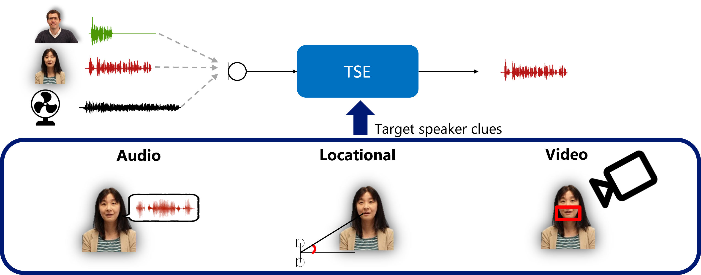

## Supporting materials

Here you can find supporting materials for [Interspeech 2021](https://www.interspeech2021.org/){:target="_blank" rel="noopener"} tutorial on Neural target speech extraction. 

- Video [SuperLectures](https://www.superlectures.com/interspeech2021/neural-target-speech-extraction){:target="_blank" rel="noopener"} [Youtube](https://www.youtube.com/watch?v=2J5Bh9kv4ro){:target="_blank" rel="noopener"} 
- Slides [pdf](slides/tutorial_delcroix_neural_tse.pdf) 
- [SpeakerBeam implementation](https://github.com/BUTSpeechFIT/speakerbeam){:target="_blank" rel="noopener"}
- [Audio target speech extraction literature](https://docs.google.com/spreadsheets/d/1iiMhxjYQ6bR90CQ3pfQrAIOz5P2UBaMtZmu-xt7rr8U/edit?usp=sharing){:target="_blank" rel="noopener"}

Please contact us at [izmolikova@fit.vutbr.cz](mailto:izmolikova@fit.vutbr.cz) and [marc.delcroix@ieee.org](mailto:marc.delcroix@ieee.org) in case you find any mistakes.
